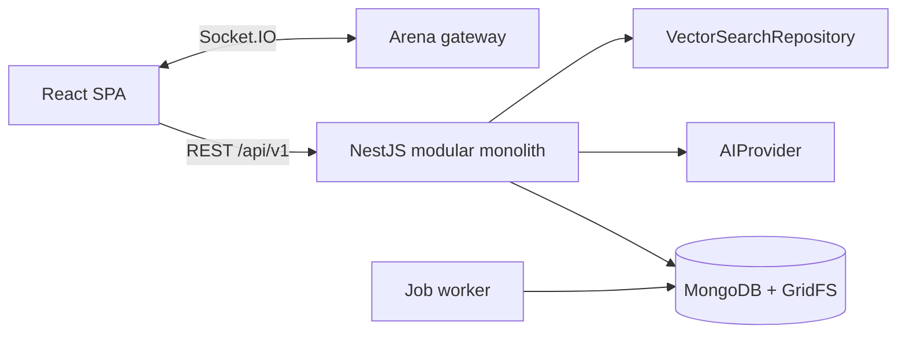

# Architecture baseline

MarxMatrix is a strict-TypeScript pnpm monorepo.

| Workspace            | Responsibility                                                          |
| -------------------- | ----------------------------------------------------------------------- |
| `apps/web`           | React/Vite browser application and API/socket clients.                  |
| `apps/api`           | NestJS REST API, gateway, persistence adapters, and worker entrypoint.  |
| `packages/contracts` | Browser-safe Zod transport schemas and inferred types.                  |
| `packages/config`    | Shared build/runtime constants once more than one workspace needs them. |

The API is a modular monolith: controllers are thin, domain services own authorization and business rules, and adapters isolate MongoDB, Gemini, and Atlas. MongoDB is authoritative; the browser only renders server snapshots for Arena. The architecture is derived from the approved design document, which is the implementation authority for later modules.
