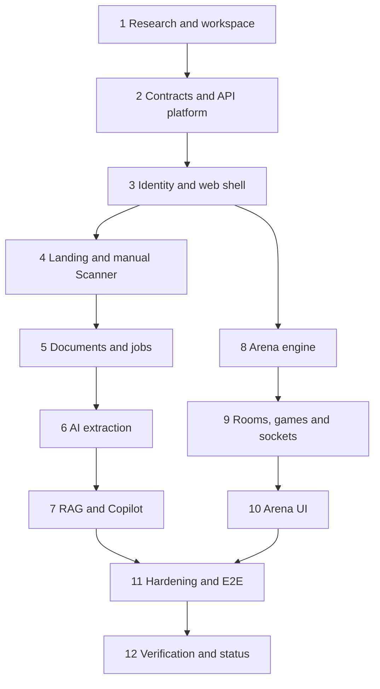

# MarxMatrix Production MVP Implementation Plan

> **For agentic workers:** REQUIRED SUB-SKILL: Use superpowers:subagent-driven-development (recommended) or superpowers:executing-plans to implement this plan task-by-task. Steps use checkbox (`- [ ]`) syntax for tracking.

**Goal:** Build and verify the complete MarxMatrix production MVP described in the approved design and autonomous build brief.

**Architecture:** A strict-TypeScript pnpm monorepo contains a React SPA, a NestJS modular monolith plus worker entry point, and transport-safe shared Zod contracts. Each domain is delivered as a test-first vertical slice; MongoDB is authoritative, Gemini/Atlas are adapters, and demo/test paths never require external AI.

**Tech Stack:** Node >=22.22, pnpm 11, TypeScript, React/Vite, NestJS, MongoDB/Mongoose/GridFS, Socket.IO, Zod, TanStack Query, React Hook Form, Zustand, Motion, Recharts, React-PDF/PDF.js, Google GenAI SDK, Pino, Vitest, Supertest and Playwright.

---

## Program rules

- Preserve and do not modify the pre-existing untracked `gsap-skills/` directory.
- Never create `.env`, install/copy an Agent Skill, add an MCP server, commit or push.
- Use `apply_patch` for source edits and pnpm only for product dependencies.
- Every behavioral task follows RED → run the focused test and observe the expected failure → minimal GREEN → focused pass → relevant package suite.
- Keep shared transport contracts in `packages/contracts`; never expose Mongoose documents or duplicate browser/server DTOs.
- Keep Scanner and Arena mathematics pure and deterministic. LLM output is schema-validated data, never executable instructions or arithmetic authority.
- Record only commands actually run and results actually observed in `docs/PROJECT_STATUS.md`.

## Locked cross-module contracts

```ts
export interface ApiErrorBody {
  statusCode: number;
  code: string;
  message: string;
  details: ReadonlyArray<unknown>;
  requestId: string;
}

export interface AIProvider {
  extractFinancialFacts(input: FinancialExtractionInput): Promise<FinancialExtractionResult>;
  createEmbeddings(input: EmbeddingInput): Promise<EmbeddingResult>;
  generateGroundedOutline(input: GroundedGenerationInput): Promise<GroundedGenerationResult>;
  generateComparison(input: GroundedGenerationInput): Promise<GroundedGenerationResult>;
  generateCritique(input: GroundedGenerationInput): Promise<GroundedGenerationResult>;
}

export interface VectorSearchRepository {
  search(query: VectorSearchQuery): Promise<ReadonlyArray<RetrievedChunk>>;
}
```

The concrete Zod schemas are the runtime source of truth; these interfaces illustrate the boundaries all phases must preserve.

## Delivery graph



### Task 1: Research, documentation baseline and strict workspace

**Files:**
- Create: `package.json`, `pnpm-workspace.yaml`, `tsconfig.base.json`, `eslint.config.mjs`, `prettier.config.mjs`, `.gitignore`, `.dockerignore`
- Create: `apps/api/package.json`, `apps/api/tsconfig.json`, `apps/api/tsconfig.build.json`, `apps/api/nest-cli.json`
- Create: `apps/web/package.json`, `apps/web/tsconfig.json`, `apps/web/vite.config.ts`
- Create: `packages/contracts/package.json`, `packages/contracts/tsconfig.json`, `packages/config/package.json`, `packages/config/tsconfig.json`
- Create: `docs/MASTER_PLAN.md`, `docs/ARCHITECTURE.md`, `docs/ASSUMPTIONS.md`, `docs/PROJECT_STATUS.md`, `docs/DEPENDENCY_RESEARCH.md`, `docs/UI_REFERENCE_AUDIT.md`, `docs/SKILLS_TO_INSTALL_MANUALLY.md`

- [ ] Write evidence-backed research and architecture docs; explicitly state that no skill/MCP was installed and that `gsap-skills/` is pre-existing user content outside product scope.
- [ ] Add a failing `packages/contracts/src/index.test.ts` that imports `apiErrorSchema` before it exists; run `pnpm --filter @marxmatrix/contracts test:unit` and expect a missing-export failure.
- [ ] Add exact pinned dependency manifests, strict compiler options (`strict`, `noUncheckedIndexedAccess`, `exactOptionalPropertyTypes`) and root scripts `dev`, `build`, `lint`, `typecheck`, `test`, `test:unit`, `test:integration`, `test:e2e`, `format`, `seed`, `clean`, `docker:up`, `docker:down`, `verify`.
- [ ] Run `pnpm install`, then focused contracts test, lint, typecheck and empty package builds. If TypeScript 7 is incompatible, query the registry and pin the latest compatible TypeScript 6 release, documenting the decision.

### Task 2: Shared contracts and API platform

**Files:**
- Create: `packages/contracts/src/common.ts`, `auth.ts`, `scanner.ts`, `documents.ts`, `jobs.ts`, `ai.ts`, `rag.ts`, `arena.ts`, `index.ts` and matching `*.test.ts`
- Create: `apps/api/src/config/*`, `common/*`, `observability/*`, `health/*`, `main.ts`, `app.module.ts`
- Create: `apps/api/.env.example`, `apps/web/.env.example`

- [ ] Write schema tests rejecting non-finite money, invalid IDs/enums, malformed citations and invalid socket payloads; expect failures before schema exports exist.
- [ ] Implement Zod schemas for all REST/socket contracts, including the exact financial-fact fields and versioned Arena payloads.
- [ ] Write API tests for demo/production env validation, safe error shape, request ID, log redaction, `/health` and `/ready`; run and observe failures.
- [ ] Implement global prefix `/api/v1`, configured CORS, Helmet, body limits, throttling, Zod validation, OpenAPI, Pino request logs and safe exception mapping.
- [ ] Run contracts/API unit suites, strict typecheck and API build.

### Task 3: Mongo identity and React application shell

**Files:**
- Create: `apps/api/src/database/*`, `identity/*`
- Create: `apps/web/src/main.tsx`, `app/{App,providers,router}.tsx`, `styles/*`, `shared/api/*`, `shared/ui/*`, `features/auth/*`

- [ ] Write identity unit/integration tests for normalized email, indistinguishable login failures, bcrypt hashes, rotating hashed refresh sessions, logout, role rejection and ownership helpers.
- [ ] Implement user/session schemas and indexes, short access JWT, secure HTTP-only refresh cookie, guards/decorators, auth endpoints and demo-only seed behavior.
- [ ] Write web tests for protected redirect, inline login errors, one refresh attempt, skip link, main landmark and recoverable page states.
- [ ] Implement Query provider, memory-only access token session, unified API client, public/auth/protected/admin layouts and actual route guards.
- [ ] Run identity integration tests, web component tests and both builds.

### Task 4: Complete landing and manual Scanner vertical slice

**Files:**
- Create: `apps/api/src/analyses/domain/*`, `analyses/{schemas,*.service,*.controller,*.module}.ts`
- Create: `fixtures/scanner/cloud-platform-2025.json`
- Create: `apps/web/src/features/landing/*`, `features/scanner/*`

```ts
const result = {
  m: adjustedRevenue - c - v,
  mPrime: (m / v) * 100,
  organicComposition: c / v,
  profitRate: (m / (c + v)) * 100,
  evidenceCoverage: (verifiedValue / usedValue) * 100,
};
```

- [ ] Write exhaustive calculation tests for formulas, sensitivity assumptions, mixed currency/period/scale, zero denominators and all non-finite inputs; observe RED.
- [ ] Implement pure calculation types/service/domain errors without Nest, Mongo or AI imports.
- [ ] Write analysis integration tests for create/list/detail, ownership, update fact/assumptions, calculate/finalize and immutable versions; implement thin controller/service/schema/indexes.
- [ ] Write landing tests for all required sections, functional CTA routes, semantic headings and reduced motion; implement original Vietnamese techno-editorial landing with synthetic data.
- [ ] Write Scanner component tests for invalid manual form, server-produced result, evidence states, sensitivity update and version history; implement RHF/Zod forms, Query mutations, lazy chart, textual summary and required disclaimers.
- [ ] Run focused tests, full API/web unit and integration suites, typecheck and builds.

### Task 5: Secure documents and leased Mongo jobs

**Files:**
- Create: `apps/api/src/documents/*`, `jobs/*`, `worker.ts`
- Create: `fixtures/pdfs/generate-fixtures.ts`

- [x] Write validation/storage tests for size, extension, declared MIME, `%PDF-` signature, filename sanitization, checksum reuse and compensating GridFS cleanup.
- [x] Implement metadata/page schemas, GridFS storage and ownership-protected upload/list/detail/status/page/delete endpoints.
- [x] Write job race tests proving one atomic claim, lease expiry, bounded retry, terminal errors and graceful shutdown.
- [x] Implement allow-listed job payloads, unique idempotency keys, `findOneAndUpdate` claim, locked completion/failure and worker polling.
- [x] Write parser tests for ordered pages, idempotent rerun and explicit `OCR_UNSUPPORTED`; implement PDF.js page extraction and `parse_pdf` handler.
- [x] Run document/job unit and Mongo integration suites.

### Task 6: AI provider and financial extraction

**Files:**
- Create: `apps/api/src/ai/*`
- Create: `apps/api/src/analyses/financial-extraction.service.ts`, `extract-financials.handler.ts`
- Create: `fixtures/ai/mock-responses.ts`

- [x] Write provider contract tests shared by mock/Gemini adapters plus timeout, retry classification, schema failure, no-key and redacted-usage tests.
- [x] Implement `AIProvider`, explicit mock/unavailable providers and backend-only Gemini adapter with configured models, structured output, prompt versions and bounded resilience.
- [x] Write extraction tests requiring page/chunk/evidence, `needs_review`, no calculator call and no repeat AI call after reclassification.
- [x] Implement `extract_financials` job and Scanner upload/status/evidence UI with simulated and unavailable badges.
- [x] Run AI/analysis unit and integration suites with no live Gemini.

### Task 7: Page-aware RAG, citation firewall and Copilot

**Files:**
- Create: `apps/api/src/rag/*`, `admin/*`
- Create: `fixtures/course/mln112-demo-pages.ts`
- Create: `apps/web/src/features/copilot/*`, `features/admin-documents/*`

- [x] Write chunker/local-search tests for page boundaries, overlap, checksum idempotency, cosine ordering, zero vector and mandatory filters.
- [x] Implement chunk schema/indexes, ingestion/reindex handlers, explicit Atlas and local-demo repositories with no silent production fallback.
- [x] Write citation tests for nonexistent, unretrieved, wrong-course/document and out-of-range pages plus valid multi-page citations.
- [x] Implement bounded retrieval/generation and citation firewall for query/outline/comparison/critique; return the mandated Vietnamese insufficiency warning.
- [x] Write admin role tests and implement upload/reindex/job retry endpoints.
- [x] Write Copilot/admin component tests and implement mode-specific output, page-linked citations, ingestion jobs, unavailable/warning/demo states.
- [x] Run RAG/admin API integration, web component and production build suites.

### Task 8: Pure deterministic Arena engine

**Files:**
- Create: `apps/api/src/arena/engine/{arena.config,seeded-rng,arena-engine,decision-rules,round-resolver,crisis-rules,acquisition-rules}.ts` and matching specs

- [x] Write tests for identical-seed equivalence, exact lifecycle, deadline ownership, bounded decisions, neutral defaults and stale/wrong-round/late rejection.
- [x] Implement immutable initial state and phase transitions with every coefficient in `GameConfig`.
- [x] Write deterministic economic tests covering cash, capital, workers, wage, automation, productivity, reputation, market share, inventory, debt, `c/v/m`, bankruptcy and every crisis.
- [x] Implement resolver returning next snapshot plus domain events; reject every non-finite result.
- [x] Write and implement bankruptcy acquisition tests/rules and game-over conditions.
- [x] Run the complete engine unit suite and repeat a seed test to prove stable output.

### Task 9: Durable rooms/games and authenticated Socket.IO

**Files:**
- Create: `apps/api/src/rooms/*`, `games/*`, `arena-gateway/*`

- [ ] Write room tests for unique code, TTL, capacity, ready, host start, leave, demo bot and no join after start; implement schemas/services/controllers.
- [ ] Write game tests for compare-and-set version increments, idempotent decisions, concurrent submissions, ordered unique events, replay and durable reload.
- [ ] Implement authoritative snapshot/event persistence and REST endpoints.
- [ ] Write deadline recovery/bot tests; implement overdue recovery and a bot using the same public decision contract.
- [ ] Write two-client socket integration tests for auth/origin, validation, throttling, ready/start, submit/duplicate/stale, resolution, reconnect and stale-snapshot suppression.
- [ ] Implement typed gateway event maps, handshake auth and versioned snapshot broadcasts.
- [ ] Run Arena unit, REST integration and Socket.IO integration suites.

### Task 10: Arena browser experience and landing polish

**Files:**
- Create: `apps/web/src/features/arena/{api,socket,pages,components}/*`
- Modify: `apps/web/src/app/router.tsx`, landing Arena/CTA sections and global motion/accessibility styles

- [ ] Write store tests accepting only newer snapshots, cleaning listeners and syncing on reconnect; implement Query REST boundary and ephemeral Zustand socket store.
- [ ] Write lobby tests for protected routing, create/join validation, roster, ready/start roles and keyboard/focus behavior; implement `/arena`, `/arena/create`, `/arena/:roomCode`.
- [ ] Write match tests for phase controls, one idempotency key per decision, duplicate prevention, reconnect, reduced motion and replay; implement server-snapshot-only board and accessible data table/timeline.
- [ ] Update landing preview with real synthetic Arena values and working CTA, then run landing/Arena component tests and web build.

### Task 11: Security, operations and end-to-end evidence

**Files:**
- Create/complete: `docs/SECURITY.md`, `docs/TESTING.md`, `docs/DEPLOYMENT.md`, `README.md`, `AGENTS.md`
- Create: `.github/workflows/ci.yml`, `apps/api/Dockerfile`, `apps/web/Dockerfile`, `docker-compose.yml`, `apps/web/playwright.config.ts`, `apps/web/e2e/*.spec.ts`

- [ ] Write Playwright flows for auth/manual Scanner, document extraction/reclassification, admin ingestion/Copilot, Arena create/join/round/reconnect/replay and keyboard/reduced-motion behavior.
- [ ] Add isolated demo seed, CI Mongo service, mock AI/local search config, production builds and frozen-lock install.
- [ ] Complete security/deployment/testing docs with implemented mechanisms only, Atlas index instructions, HTTPS/CORS/cookie/backup guidance and Docker limitation.
- [ ] Run lint/typecheck/unit/integration/build/E2E; fix root causes, never disable checks.

### Task 12: Final verification and truthful status

**Files:**
- Modify: `docs/PROJECT_STATUS.md`, `README.md`

- [ ] Run `pnpm install --frozen-lockfile`.
- [ ] Run `pnpm lint`, `pnpm typecheck`, `pnpm test:unit`, `pnpm test:integration`, `pnpm build`, `pnpm test:e2e`, and `pnpm verify`; record command, timestamp and result.
- [ ] Attempt Docker smoke only if Docker becomes available; otherwise retain the verified `docker: unavailable` blocker without claiming success.
- [ ] Scan tracked source for `.env`, secrets, `TODO`, `FIXME`, `@ts-ignore`, arbitrary `any`, fake URLs and copied skill content.
- [ ] Confirm demo mode works without Gemini and that production AI/Atlas paths fail safely when unconfigured.
- [ ] Reconcile acceptance criteria against actual evidence and leave incomplete items explicitly incomplete.
