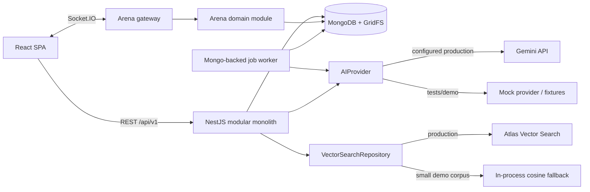

# MarxMatrix Production MVP Design

**Date:** 2026-07-19  
**Status:** Approved by the supplied autonomous build brief  
**Authority:** `MASTER AUTONOMOUS BUILD PROMPT` supplied with this task

## 1. Outcome

MarxMatrix is a Vietnamese-language learning platform that lets students apply Marxist political-economy concepts to technology-capital case studies. The production MVP has four user-facing surfaces: an editorial landing page, a deterministic financial Scanner, a source-grounded MLN112 Copilot, and a server-authoritative multiplayer Capital Arena.

The repository will be a strict-TypeScript pnpm monorepo containing a React SPA and a NestJS modular monolith backed by MongoDB. It must run in a clearly labeled demo mode without Gemini or Atlas, while production AI and vector-search paths remain configurable and documented.

## 2. Delivery approaches considered

### A. Layer-first

Build all persistence and backend modules, then all frontend screens, then tests and hardening. This creates clean infrastructure sequencing but delays usable flows and concentrates integration risk near the end.

### B. Demo-first

Build a polished landing page and fixture-driven UI before durable backend behavior. This produces an early presentation but risks a convincing shell that does not satisfy the deterministic, security, persistence, and realtime acceptance criteria.

### C. Tested vertical slices — selected

Build the foundation once, then deliver each domain as an end-to-end slice: domain rules and tests, persistence/API, then UI and integration tests. Scanner precedes AI extraction; document ingestion precedes RAG; the pure Arena engine precedes sockets. This provides continuous demonstrability, isolates failures, and keeps live Gemini/Atlas outside automated tests.

## 3. System architecture

### Repository boundaries

- `apps/web`: React 19 SPA, route layouts, feature modules, API/socket clients, accessibility and visual system.
- `apps/api`: NestJS HTTP API, Socket.IO gateway, Mongo schemas, worker process and infrastructure adapters.
- `packages/contracts`: shared Zod schemas, transport-safe DTO types, error shapes and socket event payloads. It contains no server secret or browser-incompatible code.
- `packages/config`: shared TypeScript/build constants only when they are used by more than one workspace.
- `fixtures`: synthetic financial data and project-authored course excerpts, explicitly marked as demo data.
- `docs`: architecture, ADRs, research, security, testing, deployment and status evidence.

The API and worker are separately startable processes built from the same NestJS codebase. The backend remains a modular monolith; domain modules communicate through explicit services and persisted identifiers rather than importing controllers or Mongoose documents across boundaries.

## 4. Backend modules

### Platform foundation

- `ConfigModule`: validates environment at startup and distinguishes required production values from optional demo/AI configuration.
- `IdentityModule`: registration, login, short-lived access JWT, rotating refresh session stored as a hash, HTTP-only cookie, roles and ownership helpers.
- `ObservabilityModule`: request IDs, structured Pino logs, latency, error codes, secret redaction and health/readiness checks.
- `SecurityModule`: strict CORS/origin handling, Helmet, payload limits, throttling, validation and safe errors.

### Documents and jobs

- `DocumentsModule`: metadata, GridFS bytes, MIME/magic-byte/size checks, checksum deduplication, page retrieval and ownership.
- `JobsModule`: atomic `findOneAndUpdate` claims, leases, bounded retries, idempotent handlers and graceful shutdown.
- Searchable PDFs are extracted page by page. A document with no usable text fails with the explicit `OCR_UNSUPPORTED` error.
- Local development avoids multi-document transactions; operations use atomic updates, unique indexes and compensating cleanup. Production can use a replica set without changing domain contracts.

### Scanner

- `AnalysesModule`: analysis lifecycle, facts, assumptions, evidence and immutable calculation versions.
- `CalculationService`: pure deterministic TypeScript. It validates currency, period and scale, derives `c`, `v`, adjusted revenue and `m`, and calculates surplus-value rate, organic composition, profit rate and evidence coverage.
- Invalid denominators and non-finite results produce domain errors rather than `NaN` or `Infinity`.
- AI-extracted facts always enter `needs_review` or another unconfirmed review state. Reclassification recalculates without another AI call.

### AI and RAG

- `AIProvider` defines extraction, embeddings, grounded outline and critique methods.
- `GeminiAIProvider` uses the backend-only official SDK, configured models, structured output schemas, timeouts, bounded retry/backoff, prompt versions and usage metadata.
- `MockAIProvider` is activated only by test/demo configuration and labels every result as simulated.
- `RagModule` performs page-aware chunking, embeddings, filtered retrieval, optional lexical score blending, context-limited generation and server-side citation validation.
- A citation is accepted only when its chunk exists, was in the retrieval set, belongs to the selected course/document and covers the cited page. Unsupported claims receive the specified insufficiency warning.

### Capital Arena

- `ArenaEngine` is pure, seeded and configuration-driven. The same state, decisions, seed and config produce the same next state.
- `RoomsModule` persists lobby membership, readiness, expiry and room codes.
- `GamesModule` persists snapshots and append-only sequenced events. `stateVersion` prevents stale client updates; idempotency keys prevent duplicate decisions.
- `ArenaGateway` authenticates the socket handshake, validates every payload, applies action throttles, joins server rooms and emits authoritative snapshots.
- Deadlines are persisted. Timers are an optimization, not the source of truth; recovery resolves overdue transitions from persisted `deadlineAt`.
- A demo bot uses the same public decision contract as human players.

## 5. Frontend design

### Information architecture

- Public: `/`, `/login`, `/register`.
- Protected app: `/dashboard`, Scanner, Arena, Copilot and History routes.
- Admin: `/admin/documents` behind both client affordance checks and authoritative backend role guards.
- Heavy routes and PDF/chart code are lazy-loaded. TanStack Query owns server state; Zustand is limited to ephemeral socket/session UI state.

### Visual language

The brand direction is a “digital political-economy observatory”: graphite and ink surfaces, warm ivory text, restrained signal red, cyan/amber data accents, ledger grids and annotation marks. Landing typography is editorial and expressive; application typography prioritizes dense data readability. All colors, spacing, typography, radii, shadows and motion durations come from semantic CSS variables.

The landing tells a coherent story: thesis, problem, Scanner, Arena, Copilot, method, trust, learning outcomes and final action. Product previews use real synthetic fixture values and functioning controls. It does not copy MotionSites, TypeUI, Taste Skill or GSAP skill assets, prompts or layouts.

Motion is implemented with the component-oriented Motion package. It is limited to transform/opacity, state transitions and narrative reveals; it never gates content. Reduced-motion users receive static equivalents. The pre-existing untracked `gsap-skills/` directory is not read as product code, installed, copied or modified.

### Interaction and accessibility

- Semantic landmarks, skip links, logical DOM order, keyboard navigation and visible focus.
- Forms use React Hook Form plus shared Zod schemas, inline errors and appropriate announcements.
- Dialog focus is trapped/restored; no hover-only action exists.
- Charts include textual summaries and data tables where necessary; status never relies on color alone.
- Socket listeners and animations are scoped and cleaned up. Server snapshots with older `stateVersion` are ignored.
- Every loading, empty, unavailable and recoverable error state has explicit Vietnamese copy and a useful action.

## 6. Core data flow

### Scanner

```mermaid
flowchart LR
  Input["Demo, manual facts, or PDF"] --> Persist["Analysis + document"]
  Persist --> Parse["Page extraction job"]
  Parse --> Extract["AI structured extraction when configured"]
  Extract --> Review["Human review and classification"]
  Review --> Calc["Deterministic CalculationService"]
  Calc --> Version["Immutable result version"]
  Version --> UI["Metrics, charts, evidence, sensitivity"]
```

Manual input skips parse/extract and remains fully functional without Gemini.

### RAG

Admin upload produces page text, sections, chunks and embeddings through leased jobs. A query is validated and embedded, retrieved through the configured repository, filtered to the selected material, then sent to the AI provider with only bounded context. The response is schema-validated and citations are checked against the retrieval set before returning to the browser.

### Arena

REST creates and loads durable rooms/games. Socket actions include user/session identity, round and idempotency key. The server validates the current phase and deadline, persists accepted decisions, advances the pure engine, appends sequenced events and broadcasts a new versioned snapshot. Reconnecting clients request the latest persisted state rather than replaying untrusted local actions.

## 7. Error model and resilience

All API errors use the common shape `{ statusCode, code, message, details, requestId }`. Domain errors map to stable public codes; production responses never include stack traces. Controllers remain thin and do not expose Mongoose documents.

- Missing optional Gemini configuration disables live AI features with explanatory UI; it does not prevent boot.
- Missing mandatory production configuration fails startup with named validation messages.
- Jobs record bounded failure details, release expired leases and can be retried by an authorized admin.
- File failures clean partial GridFS state when safe and retain actionable document status.
- Socket protocol errors use typed `server:error` payloads and never mutate state.
- AI authentication failures are not retried; transient failures use bounded exponential backoff.

## 8. Security design

- Passwords are hashed with bcrypt; login responses do not disclose account existence.
- Refresh tokens are random, stored only as hashes server-side and rotated through secure HTTP-only cookies. Access tokens stay in memory on the client.
- Cookie requests enforce configured origins/CORS and same-site policy; state-changing routes require valid authenticated context.
- Role and ownership checks run at the service boundary for documents, analyses, admin operations and sockets.
- Uploads enforce byte limits, allowed MIME, PDF signature and sanitized names. PDF content is untrusted data and cannot invoke tools, URLs or code.
- Zod validates transport and AI payloads; Mongo queries are constructed from allow-listed fields rather than user-provided operators.
- Logs redact credentials, cookies, tokens, API keys, raw PDFs and sensitive prompts.
- Rate limits apply globally with stricter policies for authentication, AI and socket actions.

## 9. Testing strategy

- Pure unit tests cover Scanner formulas/guards, Arena transitions/crises/acquisitions, citation validation, chunking and job retry rules.
- Component tests cover forms, route guards, error/loading states, calculation presentation, reduced motion and versioned socket state.
- API integration tests use an isolated Mongo database and mock AI provider for auth, ownership, documents, analyses, jobs, RAG and multiple Socket.IO clients.
- Playwright covers registration/login, manual Scanner analysis, PDF upload/reclassification, Arena create/join/resolve, demo Copilot and admin ingestion.
- CI never requires Gemini or Atlas. Demo fixtures are project-authored and visibly labeled.
- Root `verify` runs lint, strict typecheck, unit tests and production builds. Integration/E2E are separate mandatory evidence when the environment supports their services.

## 10. Operations and deployment

The local target is web on `5173`, API on `3000` and MongoDB on `27017`. Docker Compose documents the same topology, but native scripts remain usable when Docker is unavailable. Production uses separate web and API images, HTTPS, an explicit reverse-proxy/CORS configuration, secure cookies, MongoDB backups and an Atlas vector index.

Only `.env.example` files are committed. No `.env`, secret, skill or MCP configuration is created. Seeded demo accounts are generated only by the explicit demo seed command.

## 11. Delivery sequence and cut line

1. Research/docs and monorepo foundation.
2. Contracts, config, errors, Mongo, auth, logging, OpenAPI, CI and Docker definitions.
3. App shell and complete landing page.
4. Manual Scanner vertical slice.
5. Documents and Mongo-backed jobs.
6. Gemini extraction adapter and graceful unavailable state.
7. RAG ingestion/query/Copilot.
8. Pure Arena engine, durable rooms/games, sockets and UI.
9. Security, accessibility, performance and full verification.

If an external service is unavailable, the cut line removes only live-provider verification: Gemini calls, Atlas search and Docker smoke testing. It does not remove demo behavior, provider contracts, local search, deterministic calculations, realtime integration tests or build quality gates.

## 12. Assumptions resolved by this design

- The exhaustive autonomous build prompt is the design approval and authorizes progression without intermediate approval pauses.
- Existing untracked `gsap-skills/` belongs to the user, is preserved, and is outside MarxMatrix source/dependency scope.
- MongoDB transactions are not required for the MVP correctness model; atomic/idempotent operations are used instead.
- Only searchable PDFs are supported; OCR is explicitly out of scope.
- Live Gemini and Atlas are optional at local runtime; their production adapters and setup documentation remain required.
- Docker is not installed in the current environment, so Docker files can be built by CI or a later Docker-enabled environment but cannot be locally smoke-tested here.

