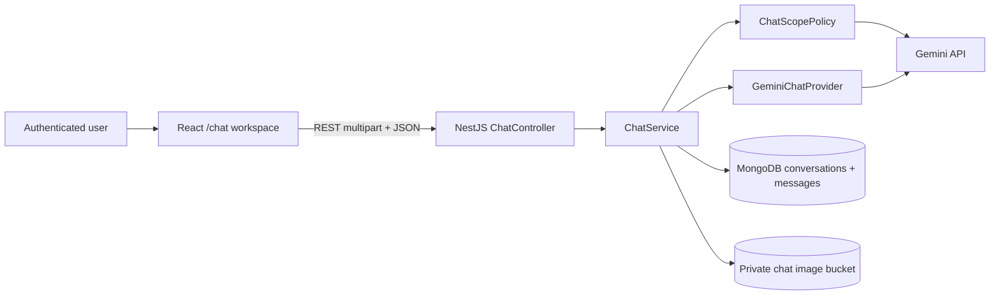

# Education and Finance AI Chatbot Design

## Goal

Add an authenticated, persistent AI chatbot to MarxMatrix that accepts text and images, reads the images with Gemini, and answers only within academic education and finance. The feature must preserve private ownership, keep the Gemini key on the server, provide complete conversation controls, and deploy through the existing `main` to EC2 workflow.

## Success criteria

- An authenticated user can create, list, open, and delete private conversations; the first message supplies a deterministic display title.
- A user can send text with zero to four JPEG, PNG, or WebP images and receive an answer that uses the visible image content.
- The chatbot accepts academic learning questions and finance questions, asks for clarification when scope is ambiguous, and refuses unrelated requests in Vietnamese.
- A user can stop an active request, retry a failed request, regenerate the latest answer, and copy an answer.
- Conversation history survives refresh and is never visible to another account.
- Image bytes, prompts, responses, access tokens, refresh cookies, and the Gemini key do not appear in application logs.
- The feature has contract, API, provider, persistence, web component, route, and production smoke-test coverage.

## Scope interpretation

“Education” means academic learning and coursework: explanations, tutoring, exercises, study planning, language learning, mathematics, sciences, history, economics, and course-related programming. “Finance” means accounting, corporate finance, economics, markets, budgeting, investment concepts, and analytical discussion.

The chatbot refuses unrelated lifestyle, entertainment, medical, legal, political-persuasion, sexual, gambling, and general-assistant requests. It may explain medical, legal, or political concepts only when the request is clearly academic and does not ask for diagnosis, legal direction, persuasion, or an operational decision. Finance answers may discuss scenarios and calculations but must not claim certainty, execute transactions, or present personalized buy/sell instructions as professional advice.

## Approaches considered

### 1. Extend the existing Copilot page

This would reuse most of the current UI, but it would mix two incompatible contracts: Copilot answers only from selected PDFs with citations, while the chatbot answers from conversation context and optional images. Source selection, citations, chat history, and image lifecycle would become tangled. Rejected.

### 2. Add a dedicated chat module and route — selected

Add `/chat` in the React application and a bounded `ChatModule` in NestJS. Reuse authentication, configuration, MongoDB, GridFS patterns, stable domain errors, and the existing Gemini operational conventions. Keep chat schemas, scope policy, persistence, and provider adapters independent of RAG. This is the clearest and most testable boundary.

### 3. Embed a third-party hosted chat widget

This is faster initially, but it weakens account ownership, private image handling, domain enforcement, observability, and UI consistency. It also introduces another vendor and storage boundary. Rejected.

## Architecture

The module boundaries are:

- `ChatController`: transport parsing, authentication decorators, multipart limits, and stable response types.
- `ChatService`: ownership, conversation ordering, run lifecycle, persistence, cancellation, and orchestration.
- `ChatScopePolicy`: structured input classification and final response validation against the education/finance boundary.
- `GeminiChatProvider`: multimodal request construction, model timeout, quota-aware retries, structured output validation, and token-only usage logging.
- `ChatImageStorage`: private GridFS persistence, signature validation, checksum calculation, owner-scoped reads, and deletion.
- Web chat feature: route, API client, query/mutation state, conversation list, message thread, attachment previews, and composer.

No chat module may import RAG persistence or pretend that a chatbot response has PDF citations. Shared Gemini retry helpers may be extracted only if both modules can depend on a small provider-neutral utility without changing RAG behavior.

## Data model

### ChatConversationRecord

- `_id`
- `ownerId`
- `title`: derived deterministically from the first non-empty user message, normalized and truncated to 80 characters; fallback `Cuộc trò chuyện có hình ảnh`
- `activeRunId`: nullable run identifier used to enforce one active generation per conversation
- `activeRunStartedAt`: nullable timestamp used to reclaim a run after an API crash or timeout
- `createdAt`, `updatedAt`

Indexes: `{ ownerId: 1, updatedAt: -1 }` and an owner-scoped lookup index on `{ _id: 1, ownerId: 1 }`.

### ChatMessageRecord

- `_id`, `conversationId`, `ownerId`
- `role`: `user` or `assistant`
- `text`: normalized user text or validated assistant text
- `attachmentIds`: ordered private attachment identifiers
- `status`: `pending`, `completed`, `refused`, `failed`, or `cancelled`
- `scope`: `education`, `finance`, `mixed`, `ambiguous`, or `out_of_scope`
- `reasonCode`: nullable `scope_ambiguous` or `out_of_scope` for a fixed clarification/refusal
- `replyToMessageId`: nullable user-message identifier for assistant responses
- `providerModel`, `promptVersion`, and nullable token counts; never provider keys or raw prompts
- `createdAt`, `updatedAt`

Indexes preserve ordered pagination by `{ conversationId: 1, createdAt: 1, _id: 1 }` and owner-scoped lookup.

### ChatAttachmentRecord

- `_id`, `conversationId`, `messageId`, `ownerId`
- private `gridFsFileId`
- `originalFileName`, canonical `mimeType`, `byteSize`, `checksum`
- `createdAt`

The API never serializes `gridFsFileId`. Attachments are deleted with their conversation. A compensating cleanup removes GridFS files if metadata creation or message persistence fails.

## Image contract

- Supported formats: JPEG, PNG, and WebP only.
- Maximum four images per message.
- Maximum 5 MiB per image and 20 MiB for the complete multipart request.
- The server validates declared MIME type, extension, and magic signature; it never trusts the browser filename.
- Empty, truncated, unsupported, or signature-mismatched files receive a stable `CHAT_IMAGE_INVALID` response.
- Images are private and never receive a public URL. The backend reads owned bytes from GridFS and sends them to Gemini as inline multimodal parts.
- The composer displays local previews before submission and revokes object URLs when previews are removed or the component unmounts.

A message must contain non-empty text or at least one valid image. Image-only messages are classified and answered from visible image content.

## Domain enforcement

Domain enforcement is fail-closed and occurs on both sides of generation:

1. `ChatScopePolicy.classifyInput` sends the current user text, eligible image parts, and a bounded view of recent completed turns to Gemini with a strict JSON schema.
2. `education`, `finance`, and `mixed` continue. `ambiguous` returns a short clarification request. `out_of_scope` returns a fixed Vietnamese refusal without calling the answer generator.
3. The answer generator receives a system instruction containing the approved scope, untrusted-data rules, finance caution rules, and a structured response schema.
4. `ChatScopePolicy.validateOutput` validates the complete buffered candidate before it is released. A candidate outside scope is replaced with the fixed refusal; malformed output fails closed.

Image text and prior user messages are untrusted data, not instructions. The provider has no tool execution, browser, URL-fetching, shell, or transaction capability. Prompt injection in an image or message cannot change the system scope.

Because the final candidate must be checked before exposure, the first release streams progress states rather than unvalidated model tokens: `checking_scope`, `reading_images`, `generating`, then one validated final answer. This preserves a responsive UI without showing content that the output gate may reject.

## Conversation and context rules

- The server loads only messages owned by the requester in the selected conversation.
- Only completed user and assistant messages become model context; failed and cancelled assistant attempts are excluded.
- Context is bounded by a configurable message count and byte budget. The newest complete turns are retained first.
- Current images are always included. Remaining image capacity is filled from the newest completed turns, with no more than four images in one provider request.
- There is one active run per conversation. Concurrent send/regenerate attempts return `CHAT_RUN_ACTIVE`.
- A persisted run start time and maximum run age allow a new request to reclaim an abandoned run after an API restart; a live run cannot be reclaimed.
- Browser cancellation aborts the server provider signal. The user message remains; the assistant attempt becomes `cancelled` and is not model context.
- Retry reuses the same user message and owned attachments without duplicating GridFS data. Regenerate creates a new assistant attempt linked to the selected user message.
- The server derives title from the first user message without an extra AI request.

## API design

All endpoints require the existing access-token guard and derive `ownerId` from the authenticated user.

- `POST /api/v1/chat/conversations` — create an empty conversation.
- `GET /api/v1/chat/conversations?cursor=&limit=` — owner-scoped, newest-first list.
- `GET /api/v1/chat/conversations/:id?cursor=&limit=` — conversation metadata and ordered message page.
- `DELETE /api/v1/chat/conversations/:id` — delete metadata and private attachments through an idempotent cleanup flow.
- `POST /api/v1/chat/conversations/:id/messages` — multipart request with `text` and up to four `images`; returns an `application/x-ndjson` stream.
- `POST /api/v1/chat/conversations/:id/messages/:messageId/regenerate` — regenerate an answer for an owned user message and return the same NDJSON stream.
- `POST /api/v1/chat/conversations/:id/runs/:runId/cancel` — cancel the matching active run idempotently.

Cursor and request schemas live in `packages/contracts`. Transport responses expose public identifiers, timestamps, roles, text, attachment display metadata, statuses, and scope only.

The NDJSON stream emits `checking_scope`, `reading_images`, and `generating` progress events followed by exactly one `final`, `refusal`, or `error` terminal event. Errors detected before response streaming use the normal JSON error envelope; errors after headers are sent use a redacted terminal event. The client parses complete newline-delimited records from `fetch()` response chunks and ignores incomplete trailing data until the next chunk arrives.

## Web experience

- Add `AI Chat` to authenticated desktop and mobile navigation and lazy-load `/chat`.
- Desktop uses a conversation sidebar and main thread. Mobile uses a conversation drawer and a full-width thread.
- New chat, history selection, and delete controls remain accessible by keyboard.
- The composer provides text input, image picker, previews, remove controls, submit, and stop. `Ctrl+Enter` or `Cmd+Enter` submits; plain Enter inserts a newline.
- Messages show pending/refused/failed/cancelled states. Completed assistant messages provide copy and regenerate actions. Failed requests provide retry.
- Render assistant text as sanitized Markdown with raw HTML disabled. Links use safe external-link attributes.
- Display a persistent scope notice: `Chỉ hỗ trợ giáo dục và tài chính`.
- Progress labels use Vietnamese and do not falsely imply completion while scope checking or image reading is active.
- Empty, loading, error, offline, quota, and deleted-conversation states are explicitly designed and responsive.

## Error handling and quotas

Public errors use stable codes and contain no provider details:

- `CHAT_CONVERSATION_NOT_FOUND`
- `CHAT_MESSAGE_INVALID`
- `CHAT_IMAGE_INVALID`
- `CHAT_IMAGE_TOO_LARGE`
- `CHAT_RUN_ACTIVE`
- `CHAT_RUN_NOT_FOUND`
- `CHAT_AI_UNAVAILABLE`
- `CHAT_AI_AUTH_FAILED`
- `CHAT_AI_TIMEOUT`
- `CHAT_AI_REQUEST_FAILED`
- `CHAT_AI_RESPONSE_INVALID`

Gemini 429 and transient 5xx errors use bounded retries and honor provider retry delays. A configurable per-user request limit protects the key; the initial default is ten message or regeneration requests per minute, with only one active run per conversation. The UI distinguishes quota/backoff from invalid input and keeps retryable user content in the composer.

## Configuration

- Reuse the backend-only `GEMINI_API_KEY`.
- Require `GEMINI_CHAT_MODEL` when chat is enabled; production configuration must select a Gemini model that accepts image input and structured output.
- `CHAT_ENABLED` defaults to false unless the model and key are configured.
- `CHAT_AI_TIMEOUT_MS`, `CHAT_AI_MAX_RETRIES`, `CHAT_MAX_CONTEXT_MESSAGES`, `CHAT_MAX_CONTEXT_BYTES`, `CHAT_MAX_RUN_AGE_MS`, and `CHAT_RATE_LIMIT_PER_MINUTE` are validated bounded integers.
- Image count and byte limits are server constants shared with browser-safe contracts where useful; client checks improve UX but never replace server enforcement.

## Privacy and security

- All conversation, message, attachment, retry, regeneration, and deletion queries include `ownerId`.
- Cross-account identifiers return the same not-found response as absent identifiers.
- The Gemini key remains in the API environment and is never included in browser bundles or responses.
- Logs contain event name, model, duration, scope result, attachment count, byte count, and token counts only. They exclude message text, image bytes, filenames, generated answers, credentials, and provider payloads.
- Uploaded images remain private in GridFS and are sent only to the configured AI provider for the requested answer.
- Multipart limits are enforced before persistence; failed multi-file operations clean up previously stored parts.
- Markdown rendering disables raw HTML and script execution.
- Deletion is idempotent and handles interrupted GridFS cleanup without exposing stale files to users.

## Testing strategy

### Contracts

- Request/response schema acceptance and rejection.
- Cursor limits, message states, scope values, attachment metadata, and public error shapes.

### API and persistence

- Authentication and owner scoping for every endpoint.
- Conversation ordering, pagination, title derivation, delete idempotency, and cross-account not-found behavior.
- Image count, byte limits, MIME/extension/signature validation, checksum, GridFS compensation, and no internal identifiers.
- One-active-run fencing, abort propagation, retry without image duplication, regeneration linkage, and context exclusion for failed/cancelled attempts.

### AI provider and scope policy

- Text-only, image-only, and mixed multimodal request construction.
- Education, finance, mixed, ambiguous, and out-of-scope classifications.
- Fixed refusal without answer generation for rejected input.
- Malformed scope/output schemas fail closed.
- Prompt injection text inside user content or image-derived content cannot change the system instruction.
- Timeout, cancellation, authentication error, 429 retry delay, transient 5xx retry, and redacted logging.

### Web

- Protected route and navigation visibility.
- Conversation creation/list/open/delete and refresh persistence.
- Composer validation, four-image limit, preview cleanup, image-only submission, progress states, stop, retry, regenerate, and copy.
- Safe Markdown rendering, responsive sidebar/drawer, keyboard operation, focus management, and accessible status announcements.

### Production verification

- Run repository ops tests, lint, typecheck, unit tests, integration tests relevant to Mongo/GridFS, and production build.
- Deploy the exact `main` commit to EC2.
- Verify public health, API/worker/nginx status, authenticated text-only chat, one education image, one finance image, an image-only request, an ambiguous request, an out-of-scope refusal, conversation reload, cancellation, and cross-account isolation.

## Rollout and observability

- The route is available to authenticated users once the API reports the chat provider configured.
- Readiness remains healthy if chat is disabled by missing optional configuration, but chat endpoints return `CHAT_AI_UNAVAILABLE`.
- Emit redacted completion, refusal, cancellation, provider-failure, and attachment-cleanup events.
- Monitor request latency, refusal rate, 429 rate, provider failures, cancellation rate, and orphan-cleanup failures without recording content.

## Explicit non-goals

- PDF-grounded citations in chatbot answers; that remains Copilot.
- Web browsing, URL fetching, tools, code execution, trading, payments, or transaction execution.
- Voice input/output, document formats other than the supported images, group conversations, message editing, sharing, public links, or admin review of private conversations.
- Token-by-token output before final domain validation.
